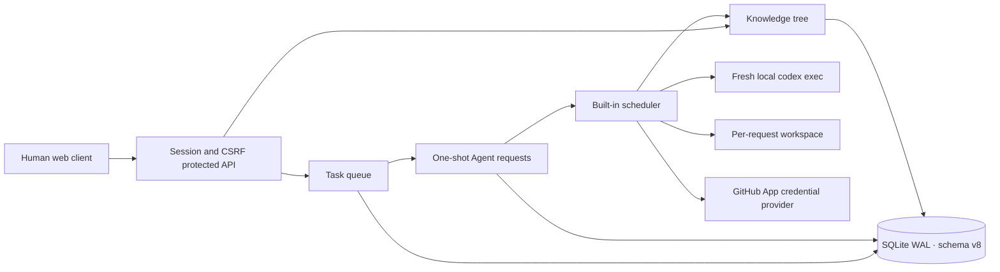

# Architecture

## Module boundaries

- `internal/workqueue` owns task creation, four-state transitions, blocking and task conversation. It emits transactional hooks when a task requests Agent work or reaches `closed`.
- `internal/agentrequest` owns the immutable one-shot request lifecycle, retry lineage, plan approval and project compaction policy.
- `internal/agentexec` claims queued requests, accounts for Agent capacity, starts a fresh Codex session, prepares a per-request workspace, records raw evidence, applies results and cleans workspaces.
- `internal/knowledge` owns the project tree, optimistic versions, Agent locks, revisions, immutable project files, keyword search, read-only snapshots and transactional structured operations.
- `internal/providers` owns GitHub App integration. Short-lived repository credentials are injected only into Git child processes.
- `internal/server` owns authorization, HTTP transport and the embedded UI.

## Invariants

1. There is no generic Agent-request creation API. Task actions, plan approval, task closure, retry and compaction policy create known request types.
2. A retry is a new request and a new Codex session. A request row never returns to `queued` after reaching a terminal status.
3. Closing a task and creating its `task_knowledge` request share one SQLite transaction.
4. Knowledge operations are complete node operations, never patches. The entire operation list succeeds or rolls back.
5. An Agent lock applies only to that node. It blocks Agent update, move and delete; a locked node anywhere in a deleted subtree rejects the delete. Humans can still modify it.
6. Project knowledge maintenance is serialized. At most one task/global knowledge request runs for a project at a time.
7. Viewers can read task, knowledge and Agent-request results. Only developers and administrators can mutate them or inspect raw Agent logs.

## Runtime lifecycle

The scheduler is woken by API changes and polls as a fallback. A queued request atomically becomes `running` with one active Agent. Restart marks interrupted requests `failed`; users create a new retry request if needed.

Task execution requests clone the repository and create a request-specific branch. Knowledge requests use a small request workspace containing a read-only `PROJECT_KNOWLEDGE.md` snapshot. All request types receive the same knowledge snapshot in their prompt.

Successful task execution moves the source task through the normal workqueue transitions, so automatic closure also triggers task knowledge extraction. Successful knowledge requests submit `knowledgeOperations`; the knowledge module validates locks, versions, project ownership and file references before committing.

Schema v8 is intentionally incompatible with earlier schemas. Startup rejects old databases rather than running a migration.
