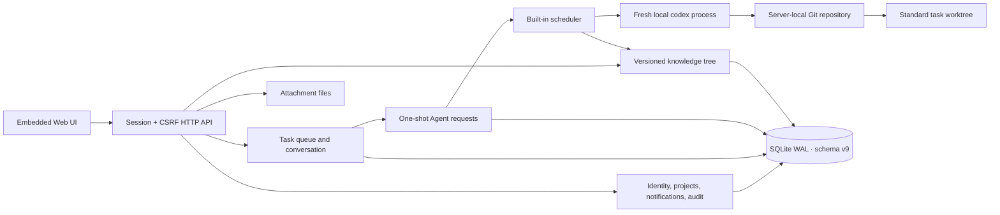

# Architecture

## Runtime shape

`cmd/projectboard` starts one HTTP server bound to `127.0.0.1`, one SQLite connection in WAL mode, and the built-in Agent executor. Static UI assets are embedded in the binary. Production TLS is expected at a reverse proxy.

The data directory contains the default database, task attachments and request-scoped temporary workspaces. Standard task worktrees are instead created in a `worktrees/` directory beside the bound project repository.

## Module boundaries

- `internal/server` owns HTTP routing, cookie sessions, CSRF, authorization, users, memberships, notifications, audit, attachments and the embedded UI boundary.
- `internal/projectrepo` validates immutable absolute project paths, initializes repositories and baseline commits, manages standard task worktrees, and exposes guarded local Git operations.
- `internal/workqueue` owns task creation, workflow transitions, assignment, followers, blocking, relationships and conversation. It emits transactional hooks for Agent work and task closure.
- `internal/agentrequest` owns one-shot request state, retry lineage, plan approval and knowledge-compaction policy.
- `internal/agentexec` claims queued requests, accounts for Agent capacity, prepares repositories or workspaces, invokes Codex, records raw evidence, applies results and cleans validated workspaces.
- `internal/knowledge` owns the project tree, keyword search, optimistic versions, node-local Agent locks, revisions, read snapshots and transactional structured operations.
- `internal/store` owns schema v9 creation and strict version compatibility.
- `internal/ops` owns consistent SQLite backup and checked restore. File attachments are outside that database operation.

## Authorization model

System roles are `administrator` and `user`. Administrators manage organization users, local Agents, projects, system settings and global activity. Project access is granted through `developer` or `viewer` membership; developers can mutate project resources and viewers are read-only.

Authentication uses seven-day cookie sessions. Unsafe API methods require a CSRF token matching both the session record and CSRF cookie. Production mode marks cookies Secure. Failed login attempts are rate-limited per username and client IP.

## Core invariants

1. A project path is an immutable, unique, absolute path to a local Git repository root.
2. There is no generic Agent-request creation API. Task actions, plan approval, closure, retry and compaction policy create known request types.
3. A retry or continuation is a new request and a fresh Codex session. Terminal request rows never return to `queued`.
4. Closing a task and creating its `task_knowledge` request share one SQLite transaction.
5. Knowledge mutations are complete node operations, never partial patches; the complete operation list succeeds or rolls back.
6. Agent locks apply only to the selected node. Humans may still modify it, and children may be created below it.
7. Project knowledge maintenance is serialized. At most one task or global knowledge request runs for a project at a time.
8. Standard work runs on `projectboard/<project-key>/<task-number>` in sibling `worktrees/<project-key>-<task-number>`. Simple-conversation and merge work run in the project repository.
9. Writes to a project repository are serialized. ProjectBoard never automatically resets, stashes, fetches, pulls or pushes.
10. Schema v9 rejects every other schema version rather than attempting an implicit migration.

## Task and request state

Standard tasks use `created → in_progress → completed → closed`. Simple-conversation tasks use `created → in_progress → closed`. Blocking is an independent state, not an additional stage.

Agent requests use `queued`, `running`, `succeeded`, `failed` or `cancelled`. Each request stores its command, prompt, thread ID, raw JSONL, final message, result, workspace, timestamps and error. Plan approval and retry preserve lineage by creating another request.

The scheduler is event-woken with polling fallback. Agent selection applies status, capacity and accept/reject tags. Interrupted, invalid, dirty, stalled or failed requests preserve evidence and pause the related task safely. Main-repository writes are serialized per project; ordinary task worktrees may execute independently.

## Persistence and failure boundaries

SQLite is the system of record for identity, projects, tasks, requests, knowledge, notifications and activity. Uploaded attachment bytes live under `data/attachments/`; their metadata and ownership live in SQLite. An attachment upload is limited to 25 MiB.

The database uses one connection, foreign keys, WAL and a five-second busy timeout. Backup uses SQLite `VACUUM INTO`; restore performs `quick_check`, preserves the current database as `.before-restore`, and should run while the service is stopped.
