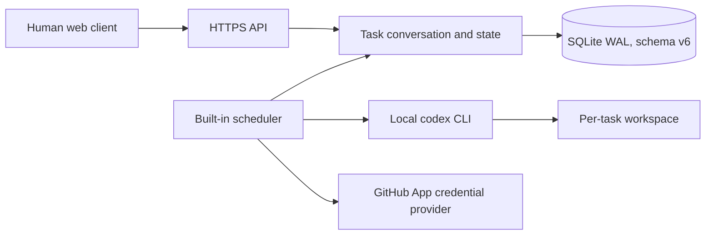

# Architecture

## Module boundaries

`internal/workqueue` owns task creation, the four-state transition rules, blocking, conversation writes and explicit Agent resume semantics.

`internal/agentexec` owns scheduling, capacity accounting, atomic claim, workspace preparation, Codex process lifecycle, session continuation, structured result validation, execution evidence and cleanup restrictions.

`internal/providers` owns GitHub App integration. Repository credentials are issued for the selected project and injected only into a Git child process; Codex does not receive the token.

`internal/server` owns the session/CSRF-protected human API and embedded UI. Agent project grants express participation only.

## Runtime lifecycle

The scheduler is woken by relevant API changes and also polls as a fallback. On restart, running executions are recorded as interrupted and their tasks enter failure pause with workspace and session retained. Removing an Agent cancels its processes and requeues non-closed tasks without their Agent/session binding.

Each task workspace is retained after closure until an authorized member explicitly cleans it. Cleanup validates that the target remains beneath the managed workspace directory.

Schema v6 is intentionally incompatible with earlier schemas; startup rejects old databases instead of migrating them.
