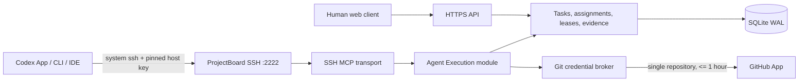

# Architecture

## Deep module boundaries

`internal/agentexec` owns Agent authorization, task discovery and ordering, atomic claim, one-Agent/one-lease capacity, heartbeat, release, environment evidence and task lifecycle operations. Transports call it directly; they do not forward to internal HTTP handlers.

`internal/server/agent_ssh.go` owns SSH authentication and protocol restrictions. It accepts only registered Ed25519 keys, permits only `projectboard-mcp` and execution credential commands, enforces one primary session, and rejects shells, PTYs, file transfer and forwarding.

`internal/providers` owns GitHub App interaction. Callers provide an already-derived installation and repository; permission is fixed to `contents:write`. Issued tokens live only in the SSH gateway's memory and are revoked on submission, release, disconnect or key revocation.

The HTTPS API remains for human administration and collaboration. There is no Bearer Agent API, HTTP MCP endpoint, local stdio forwarding command, Runner process or GitLab adapter.

## Persistence and migration

Schema v5 stores `agent_ssh_keys`, `agent_ssh_sessions`, `agent_executions` and `agent_environment_steps`, plus `allow_unassigned_claim` on project Agent grants. It ends pre-migration leases with `auth_migration`, retains execution history under its new name, and removes legacy tokens, pairing, devices, local mappings, Runner status and GitLab data.
