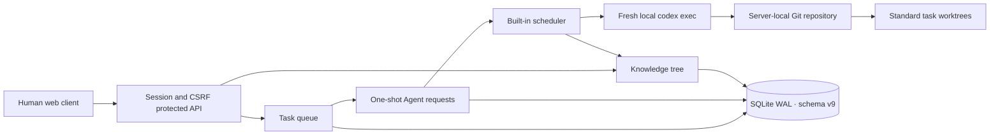

# Architecture

## Module boundaries

- `internal/projectrepo` validates immutable absolute project paths, initializes repositories and baseline commits, manages task worktrees, and exposes safe local Git operations.
- `internal/workqueue` owns task creation, workflow transitions, blocking and conversation. It emits transactional hooks when a task requests Agent work or reaches `closed`.
- `internal/agentrequest` owns the immutable one-shot request lifecycle, retry lineage, plan approval and project compaction policy.
- `internal/agentexec` claims queued requests, accounts for Agent capacity, prepares local repositories or worktrees, invokes Codex, records raw evidence, applies results and cleans managed worktrees.
- `internal/knowledge` owns the project tree, optimistic versions, Agent locks, revisions, immutable project files, keyword search, read-only snapshots and transactional structured operations.
- `internal/server` owns authorization, HTTP transport and the embedded UI. It validates project paths and target branches before domain mutations.

## Invariants

1. There is no generic Agent-request creation API. Task actions, plan approval, closure, retry and compaction policy create known request types.
2. A retry is a new request and a fresh Codex session. Terminal request rows never return to `queued`.
3. Closing a task and creating its `task_knowledge` request share one SQLite transaction.
4. Knowledge operations are complete node operations, never patches; the whole operation list succeeds or rolls back.
5. Agent locks apply to the selected knowledge node. Humans may still modify it, and children may be created below it.
6. Project knowledge maintenance is serialized. At most one task or global knowledge request runs for a project at a time.
7. Standard work runs on `projectboard/<project-key>/<task-number>` in a sibling `worktrees/<project-key>-<task-number>` directory. Simple-conversation and merge work run in the project repository.
8. ProjectBoard does not configure Git providers and does not automatically fetch, pull or push.

The scheduler is event-woken with polling fallback. Interrupted, invalid, dirty or failed requests become failed and their task is paused safely. Standard worktrees remain after closure until an authorized member requests validated cleanup.

Schema v9 intentionally rejects every earlier schema rather than attempting an unsafe migration.
