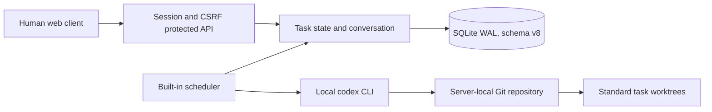

# Architecture

## Module boundaries

`internal/projectrepo` validates immutable absolute project paths, initializes repositories and baseline commits, manages task worktrees, and exposes safe Git operations.

`internal/workqueue` owns task creation, workflow-specific transitions, blocking, conversation writes, and explicit Agent review actions.

`internal/agentexec` owns tag-aware scheduling, capacity accounting, atomic claim, project-level main-repository serialization, Codex session continuity, structured result validation, merge execution evidence, and safe worktree cleanup.

`internal/server` owns the human API and embedded UI. It validates project paths and target branches before domain mutations.

## Execution lifecycle

Standard work runs on `projectboard/<project-key>/<task-number>` in a sibling `worktrees/<project-key>-<task-number>` directory. After implementation, a separate Agent invocation resumes the same session and merges with `--no-ff` in the main repository. Simple-conversation work executes directly in the main repository. Main-repository writers are serialized per project.

The scheduler is event-woken with polling fallback. Interrupted, invalid, dirty, or failed executions pause safely without automatic reset or stash. Standard worktrees remain after closure until an authorized member requests validated cleanup.

No module owns Git provider credentials: ProjectBoard does not configure providers, clone remotes, or automatically fetch, pull, or push.

Schema v8 is intentionally incompatible with every earlier schema; startup rejects old databases instead of migrating them.
